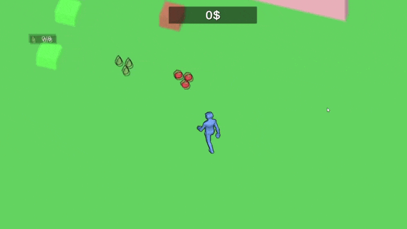

# HardBall - This is a game prototype.

This is a simple drag and drop game.  
Technology stack used on the project: `Zenject` | `UniRx` 
<b>Download to play: <a href = "https://github.com/gtfalen/HardBall/releases/tag/PC">Donwload PC Build</a></b>

 

## Collect levels with ease

- `TimerActions` - Calls the specified action, at the specified interval
- `ItemCreator` - Creates from installed items, a new item
- `ItemSpawner` - Creates items in the scene
- `ItemRepository` - Stores items
- `ItemDistributor` - Spreads items in a given area
- `ItemDefaultCollector` - Gathers a set item from <b>ItemDistributor</b>
